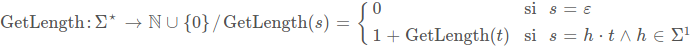
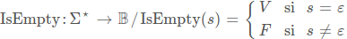
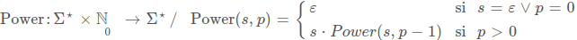
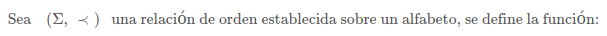
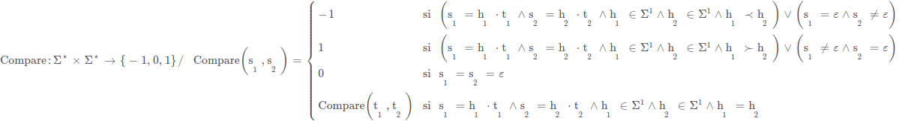

# Especificaciones matemáticas de operaciones con cadenas

1.  **GetLength: Epsilon\* -> N**

    Conjunto de salida **Epsilon\***: Clausura de Kleene del alfabeto.
    
    Conjunto de llegada **N** con 0 incluido: Conjunto de números naturales incluyendo 0.

    

    **Ejemplos**:

        GetLength() -> 0
        GetLength(abc) -> 3
        GetLength(cba) -> 3
        GetLength(hola) -> 4

2.  **IsEmpty: Epsilon\* -> \{V,F\}**

    Conjunto de salida **Epsilon\***: Clausura de Kleene del alfabeto.
    
    Conjunto de llegada **{V, F}**: Verdadero si la cadena es vacía. Falso si la cadena NO está vacía.

    

    **Ejemplos**:

        IsEmpty(abc) -> F
        IsEmpty(a) -> F
        IsEmpty() -> V

3.  **Power: Epsilon\* x N -> Epsilon\***

    Conjunto de salida **Epsilon\* x N**: Conjunto resultante del producto cartesiano de Clausura de Kleene del alfabeto y Conjunto de números naturales N. Es decir conjunto de infinitos pares ordenados (Epsilon\*, N).
    
    Conjunto de llegada **Epsilon\***: Clausura de Kleene del alfabeto.

    

    **Ejemplos**:

        Power((abc, 2)) -> abcabc
        Power((a, 3)) -> aaa

4. **Compare: Epsilon\* x Epsilon\* -> {-1, 0, 1}**
    
    Sea (Epsilon\* , <) una relación de orden sobre un alfabeto, se puede definir la función Compare de la siguiente forma:.

    Conjunto de salida **Epsilon\* x Epsilon\***: Conjunto resultante del producto cartesiano de Clausura de Kleene del alfabeto con sigo mismo. Es decir un conjunto de infinitos pares ordenados (Epsilon\*, Epsilon\*).

    Conjunto de llegada **{-1, 0, 1}**: 
    
    * Si el primer componente (primera cadena) del par ordenado es menor que el segundo entonces el resultado será un número -1. 
    
    * Si ambas cadenas son iguales el resultado será 0. 
    
    * Si la primer cadena es mayor que la segunda el resultado será un 1.

    **Observacion:** La palabra vacía pertenece a Epsilon\* pero no pertenece a Epsilon (alfabeto). Se considera que una palabra vacía es menor a todos los simbolos de Epsilon.
    
    

    

    **Ejemplos**:

        Compare((abc,abc)) -> 0
        Compare((abc,abd)) -> -1
        Compare((abd,abc)) -> 1

