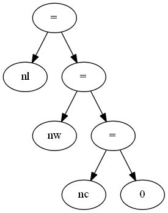
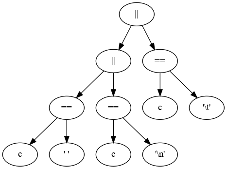

# 10 Máquinas de Estado — Palabras en Líneas

Este trabajo está basado en el ejercicio 1-12 de [KR1988]:

    1-12. Escriba un programa que imprima su entrada una palabra por línea.

Problema: Imprimir cada palabra de la entrada en su propia línea. 
La cantidadde líneas en la salida coincide con la cantidad de palabras en la entrada. Cadalínea tiene solo una palabra.

## 10.1. Objetivos

* Aplicar máquinas de estado para el procesamiento de texto.
* Implementar máquinas de estado con diferentes métodos.

## 10.2. Temas

* Árboles de expresión.
* Representación de máquinas de estado.
* Implementación de máquinas de estado.

## 10.3. Tareas

### 1.Árboles de Expresión

a. Estudiar el programa del ejemplo las sección 1.5.4 Conteo de Palabrasde [KR1988].

b. Dibujar el árbol de expresión para la inicialización de los contadores: nl= nw = nc = 0.

c. Dibujar el árbol de expresión para la expresión de control del segundo if: c == ' ' || c == '\n' || c == '\t

### 2.Máquina de Estado:

a. Describir en lenguaje dot  [DOT2015] y dentro del archivo wl.gv la máquina de estado que resuelve el problema planteado.
b. Formalizar la máquina de estados como una n-upla, basarse en el Capítulo #1 del Volumen #3 de [MUCH2012].

### 3.Implementaciones de Máquinas de Estado:Las implementaciones varían en los conceptos que utilizan para representaarlos estados y las transiciones.

#### a.Implementación #1: Una variable para el estado actual.

i. Escribir el programa wl-1-enum-switch.c que siga la Implementación #1, variante enum y switch.Esta implementación es la regularización de la implementación de lasección 1.5.4 de [KR1988]. Los estados son valores de una variable y las transiciones son la selección estructurada y la actualización de esa variable. Esta versión es menos eficiente que la versión de [KR1988],pero su regularidad permite la automatización de la construcción delprograma que implementa la máquina de estados. Además de la regularidad, esta versión debe:

* Utilizar typedef y enum en vez de define, de tal modo que la variable estado se pueda declarar de la siguiente manera: States = Out;

* Utilizar switch en vez de if.

ii. Responder en readme.md: Indicar ventajas y desventajas de la versiónde [KR1988] y de esta implementación.

#### b. Implementación #2: Sentencias goto (sí, el infame goto).

i. Leer la sección 3.8 Goto and labels de [KR1988].
ii. Leer Go To Statement Considered Harmful de [DIJ1968].
iii. Leer "GOTO Considered Harmful" Considered Harmful de [RUB1987].
iv. Responder en readme.md: ¿Tiene alguna aplicación go to hoy en día? ¿Algún lenguaje moderno lo utiliza?
v. Escribir el programa wl-2-goto.c que siga la Implementación #2. En esta implementación los estados son etiquetas y las transicionesson la selección estructurada y el salto incondicional con la sentencia goto.

#### c. Implementación #3: Funciones Recursivas.

i. Leer la sección 4.10 Recursividad de [KR1988].
ii.Responder en readme.md: ¿Es necesario que las funciones accedana a contadores? Si es así, ¿cómo hacerlo?.Leer la sección 1.10 Variables Externas y Alcance y 4.3 VariablesExternas de [KR1988].
iii.Escribir el programa, wl-3-rec.c que siga la implementación #3.En esta implementación los estados son funciones recursivas y lastransiciones son la selección estructurada y la invocación recursiva.

#### d. Implementación #X:

Es posible diseñar más implementaciones. Por ejemplo, una basada en una tabla que defina las transiciones de la máquina. En ese caso,el programa usaría la tabla para lograr el comportamiento deseado. El objetivo de este punto es diseñar una implementación diferente a las implementaciones #1, #2, y #3.

i.Diseñar una nueva implementación e indicar en Readme.md cómo esa implementación representa los estados y cómo las transiciones.
ii.Escribir el programa, wl-x.c que siga la nueva implementación.

### 4.Eficiencia del uso del Tiempo:

Construir una tabla comparativa a modo de benchmark que muestre el tiempo de procesamiento para cada una de las cuatro implementaciones, para tresarchivos diferentes de tamaños diferentes, el primero en el orden de loskilobytes, el segundo en el orden de los megabytes, y el tercero en el ordende los gigabytes.La tabla tiene en las filas las cuatro implementación, en las columnas los tresarchivos, y en la intersección la duración para una implementación para unarchivo.