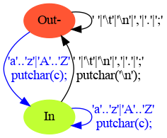

# 10 Máquinas de Estado — Palabras en Líneas

Este trabajo está basado en el ejercicio 1-12 de [KR1988]:

    1-12. Escriba un programa que imprima su entrada una palabra por línea.

Problema: Imprimir cada palabra de la entrada en su propia línea. 
La cantidadde líneas en la salida coincide con la cantidad de palabras en la entrada. Cadalínea tiene solo una palabra.

## 10.1. Objetivos

* Aplicar máquinas de estado para el procesamiento de texto.
* Implementar máquinas de estado con diferentes métodos.

## 10.2. Temas

* Árboles de expresión.
* Representación de máquinas de estado.
* Implementación de máquinas de estado.

## 10.3. Tareas

### 1.Árboles de Expresión

a. Estudiar el programa del ejemplo las sección 1.5.4 Conteo de Palabrasde [KR1988].

b. Dibujar el árbol de expresión para la inicialización de los contadores: nl= nw = nc = 0.

c. Dibujar el árbol de expresión para la expresión de control del segundo if: c == ' ' || c == '\n' || c == '\t

### 2.Máquina de Estado:

a. Describir en lenguaje dot  [DOT2015] y dentro del archivo wl.gv la máquina de estado que resuelve el problema planteado.

b. Formalizar la máquina de estados como una n-upla, basarse en el Capítulo #1 del Volumen #3 de [MUCH2012].

Máquina de estado **"Palabras por Línea"** es una **5-upla (Q, Sigma, T, A, I)**.

* **Q = {Out, In}**: es el conjunto de estados posibles

* **Sigma = {'a',...,'z','A',...,'Z',' ','\t','\n',',','.'';'}**: es el conjunto de simbolos que el Autómata es capaz de entender.

* **T: Q x Sigma -> Q**: es una función de transición descripta por la siguiente tabla. Un estado pasa a otro a través de la aceptación de diferentes símbolos de Sigma.

    |     | a\|b..\|z\|A\|B..\|Z | ' '\|'\t'\|'\n'\|'.'\|','\|';' |
    |-----|----------------------|--------------------------------|
    | Out | In                   | Out                            |
    | In  | In                   | Out                            |

* **A: Q x Sigma x Q -> "Acción" en lenguaje C**, es una función que asigna acciones específicas a las transiciones descriptas en T. Las acciones en este ejemplo son código en lenguaje C.

    Transición de Origen: es una 3-upla, la primer componente es el estado origen, la segunda componente es el símbolo por el cual se transiciona al estado final, la tercer componente es el estado final tras la recepción del símbolo.

    Acción asociada: es una instrucción escrita en lenguaje C.

    | Transición de Origen                      | Acción asociada |
    |-------------------------------------------|-----------------|
    | (Out, 'a'\|'b'...'z'\|'A'\|'B'...'Z', In) | putchar(c);     |
    | (In, 'a'\|'b'...'z'\|'A'\|'B'...'Z' ,In)  | putchar(c);     |
    | (In, ' '\|'\t'\|'\n'\|'.'\|','\|';', Out) | putchar('\n');  |

* **I = Out**: estado inicial del autómata.

### 3.Implementaciones de Máquinas de Estado:

Las implementaciones varían en los conceptos que utilizan para representaarlos estados y las transiciones.

#### a.Implementación #1: Una variable para el estado actual.

i. Escribir el programa wl-1-enum-switch.c que siga la Implementación #1, variante enum y switch.Esta implementación es la regularización de la implementación de lasección 1.5.4 de [KR1988]. Los estados son valores de una variable y las transiciones son la selección estructurada y la actualización de esa variable. Esta versión es menos eficiente que la versión de [KR1988],pero su regularidad permite la automatización de la construcción delprograma que implementa la máquina de estados. Además de la regularidad, esta versión debe:

* Utilizar typedef y enum en vez de define, de tal modo que la variable estado se pueda declarar de la siguiente manera: States = Out;

* Utilizar switch en vez de if.

ii. Responder en readme.md: Indicar ventajas y desventajas de la versión de [KR1988] y de esta implementación.

| Versión                                   | Ventajas                                                                                                                                                                                                                                                                                                                                                                          | Desventajas                                                                                                                                                                                                                                                                                                                                                                                                                         |
|-------------------------------------------|-----------------------------------------------------------------------------------------------------------------------------------------------------------------------------------------------------------------------------------------------------------------------------------------------------------------------------------------------------------------------------------|-------------------------------------------------------------------------------------------------------------------------------------------------------------------------------------------------------------------------------------------------------------------------------------------------------------------------------------------------------------------------------------------------------------------------------------|
| **Estado como "Constante simbólica #define"** | 1. La definición como constante simbólica #define permite concentrar en una sola región del programa las definiciones de estados, esto es útil en caso de que se requiera cambiar el valor de un estado o incorporar nevos estados.   2. Se pueden definir constantes simbólicas de muchos tipos: pueden ser valores decimales que se asignan a un float o double, pueden ser cadenas literales que se asignen a un char[] o pueden ser char aislados también. | 1. El estado es un valor constante que se define con instrucciones de preprocesamiento: es decir que no existe como un tipo en el programa, sólo como una interpretación.  2. La variable que guarda el estado puede admitir otros valores enteros que podrían no ser un estado válido, esto no debería ocurrir en la lógica del programa pero no hay ninguna restricción que impida asignar un entero cualquiera a la variable estado. |
| **Estado como "enum"**| 1. La definición como enum permite concentrar en una sóla región del programa la definición de los estados posibles. Esto permite agregar, remover o editar estados más facilmente.   2. Se pueden asignar valores no consecutivos a cada definición por separado por ejemplo **enum States {stateA = 1, stateB = 7};** también se puede asignar un valor inicial al primer elemento y el compilador se encargará de asignar el resto de los valores enteros de forma sucesiva y creciente, por ejemplo **enum States {stateA = 1, stateB, stateC};** donde stateB será 2 y stateC será 3. | 1. El estado ahora es un tipo de dato, sin embargo es posible asignarle valores enteros que no forman parte de la declaración del enum y que el programa continúe en ejecución  sin abortar o generar ningún tipo de excepción, con lo cual no presenta una ventaja en relación a la constante #define.  3. No se pueden definir enums con valores decimales ni cadenas, sólo valores enteros.|

#### b. Implementación #2: Sentencias goto (sí, el infame goto).

i. Leer la sección 3.8 Goto and labels de [KR1988].

ii. Leer Go To Statement Considered Harmful de [DIJ1968].

iii. Leer "GOTO Considered Harmful" Considered Harmful de [RUB1987].

iv. Responder en readme.md: ¿Tiene alguna aplicación go to hoy en día? ¿Algún lenguaje moderno lo utiliza?

Podría ser utilizado para reducir la complejidad de ciertos algoritmos, tanto en operaciones como en cantidad de código. Esto depende del caso, pero usar la instrucción GOTO no es equivalente a complejizar un algoritmo: tomo como ejemplo el algoritmo para encontrar la primera fila completa de 0 en una matriz N x N ejemplificada en el documento http://web.archive.org/web/20090320002214/http://www.ecn.purdue.edu/ParaMount/papers/rubin87goto.pdf.

En este escenario, el algoritmo que utiliza goto, usa menos variables: solamente 2, que son los contadores por cada estructura de bucle usada para recorrer la matriz.

En cambio, en el ejemplo que evita usar goto, además de los contadores de los bucles se crea un flag booleano para representar el estado de "allzero" de una fila de la matriz: este flag booleano termina formando parte de las condiciones de fin de bucle lo cual incrementa las operaciones que se necesitan para evaluar si un bucle debe terminar o no.

**Otras posibles situaciones donde sería util** (https://stackoverflow.com/questions/24451/is-it-ever-advantageous-to-use-goto-in-a-language-that-supports-loops-and-func):

1. Salida rápida y limpia de una función: en funciones donde se requiera reservar muchos recursos y donde la lógica tenga multiples salidas se puede generar una etiqueta de salida única donde se haga una limpieza y se salga de la función en lugar de replicar el código de limpieza en cada sección de salida.

2. Salida de bucles anidados: si estás en un bucle anidado adentro de otro es mucho más fácil salir de ambos mediante un goto en lugar de invocar un break; ya que solamente saldría de la estructura inmediatamente próxima.

3. Mejoras de performance de bajo nivel: la ejecución de una instrucción goto es rápida y puede ser utilizada para mejorar la velocidad en la que se ejecuta una función. Este escenario sería sólo necesario en funciones donde la velocidad es un factor crítico. Una desventaja de esto es que al utilizar goto una función , esta no podrá ser optimizada por el compilador.

**Lenguajes modernos que utilizan goto:**

1. Go.

2. C#

**Lenguajes modernos que NO utilizan goto:**

1. Swift.

2. Rust.

3. Javascript.

4. Java (pero soporta etiquetas que pueden ser aplicadas a bucles para especificar su interrupción mediante "break").

5. Ruby.

6. Kotlin (pero soporta etiquetas en sentencias "break" y "continue" que le permiten romper las estructuras etiquetadas o continuar con ellas)

*Fuente*: https://rosettacode.org/wiki/Jump_anywhere

v. Escribir el programa wl-2-goto.c que siga la Implementación #2. En esta implementación los estados son etiquetas y las transiciones son la selección estructurada y el salto incondicional con la sentencia goto.

#### c. Implementación #3: Funciones Recursivas.

i. Leer la sección 4.10 Recursividad de [KR1988].

ii.Responder en readme.md: ¿Es necesario que las funciones accedan a contadores? Si es así, ¿cómo hacerlo?.Leer la sección 1.10 Variables Externas y Alcance y 4.3 VariablesExternas de [KR1988].

**Cuando una función necesita acceder datos para realizar su tarea estos pueden ser alcanzados de las siguientes formas**:

1. Mecanismo de argumentos: los datos son suministrados a la función a través de un listado de argumentos. Dentro del contexto interno de la función, estos argumentos serán creados automáticamente al momento de invocar a la función pero es necesario proporcionarselos al momento de invocarla.

2. Mecanismo de Variables Externas: los datos son alojados a variables globales externas a la función, esto significa que pueden ser accedidos por cualquier función. La función ya no recibe esos datos como parte de sus parámetros, pero igualmente los puede alcanzar y usar para ejecutar instrucciones con ellos.

Estos dos mecanismos pueden ser utilizados en combinación o de forma exclusiva uno del otro pero depende del propósito que se quiera lograr. Por ejemplo, en una función recursiva puede ser necesario acceder a un dato que haya sido pasado estrictamente como argumento de la función ya que este mecanismo crea una copia de ese valor en el stack y ese valor es accedido exclusivamente por esa instancia de la función y por ninguna otra, en un algoritmo recursivo esto asegura que en esa instancia la función está trabajando con un término de la recursión (matemáticamente hablando).

iii.Escribir el programa, wl-3-rec.c que siga la implementación #3.En esta implementación los estados son funciones recursivas y las transiciones son la selección estructurada y la invocación recursiva.

#### d. Implementación #X:

Es posible diseñar más implementaciones. Por ejemplo, una basada en una tabla que defina las transiciones de la máquina. En ese caso,el programa usaría la tabla para lograr el comportamiento deseado. El objetivo de este punto es diseñar una implementación diferente a las implementaciones #1, #2, y #3.

i.Diseñar una nueva implementación e indicar en Readme.md cómo esa implementación representa los estados y cómo las transiciones.

#### Implementación 4

**1. Estados**

Son números enteros.
* 0 Para estado OUT
* 1 Para estado IN

En esta implementación los estos estados son definidos como constantes simbólicas mediante *#define OUT 0* y *#define IN 1*

**2. Transición**

Las transiciones se realizan mediante la selección usando *switch(symbol)* donde *symbol* es un número entero conteniendo 1 char del flujo de entrada: *symbol = getchar()*.

**3. Acciones de una Transición**

Esta FSM tiene un estado inicial u origen y mediante la interpretación de un símbolo podrá determinar un estado destino.

Para determinar una acción asociada a una transición es necesario saber el estado "origen" y el estado "destino": estos dos componentes pueden ser interpretados como las coordenadas de un espacio R2 o las coordenadas de una matriz: coordenada = (estado_origen, estado_destino).

En esta implementación existe una matriz de acciones de transición:

    void (*actionPtr[2][2])(int);

Cada componente de esta matriz es un puntero a una función del tipo:
    
    void functionName(int value);

Luego al inicializar el programa se llena esta matriz con las acciones que queremos realizar cuando transicionemos de un estado a otro:

    actionPtr[OUT][OUT] = NULL;
    actionPtr[OUT][IN] = &PrintSymbol;
    actionPtr[IN][OUT] = &PrintLn;
    actionPtr[IN][IN] = &PrintSymbol;

Cuando un componente de la matriz tiene acción NULL significa que no queremos hacer nada.

Cuando FSM haya determinado el estado "destino" podrá usar este dato como una coordenada de la matriz y ejecutar la función-acción:

    if(actionPtr[currentState][nextState] != NULL)
            actionPtr[currentState][nextState](symbol);

ii.Escribir el programa, wl-x.c que siga la nueva implementación.

### 4.Eficiencia del uso del Tiempo:

Construir una tabla comparativa a modo de benchmark que muestre el tiempo de procesamiento para cada una de las cuatro implementaciones, para tres archivos diferentes de tamaños diferentes, el primero en el orden de los kilobytes, el segundo en el orden de los megabytes, y el tercero en el ordende los gigabytes. La tabla tiene en las filas las cuatro implementaciones, en las columnas los tres archivos, y en la intersección la duración para una implementación para un archivo.

#### Benchmark

Este benchmark se armó ejecutando las distintas versiones de la FSM con el comando time que en el sistema operativo (Ubuntu) calcula el tiempo que consume la ejecución de una aplicación. Por ejemplo:

    marcos@marcos-G800:~/Documents/repos/SSL/05-wl$ time ./wl-1-enum-switch.out < input_kb.txt > output_kb-wl-1.txt

    real    0m0,004s
    user    0m0,003s
    sys     0m0,001s
    
**Tabla**

| Implementación   | 1 kb     | 1 mb                             | 1 gb                             |
|------------------|----------|----------------------------------|----------------------------------|
| wl-1-enum-switch | 0m0,004s | 0m0,032s                         | 0m23,049s                        |
| wl-2-goto        | 0m0,003s | 0m0,026s                         | 0m24,313s                        |
| wl-3-rec         | 0m0,022s | Segmentation fault (core dumped) | Segmentation fault (core dumped) |
| wl-4             | 0m0,003s | 0m0,037s                         | 0m27,464s                        |